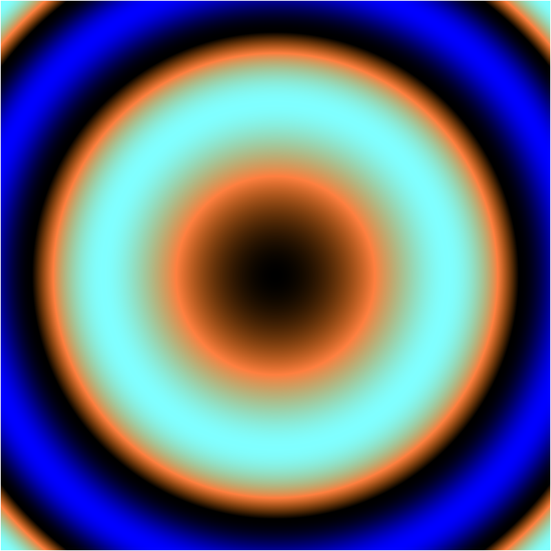
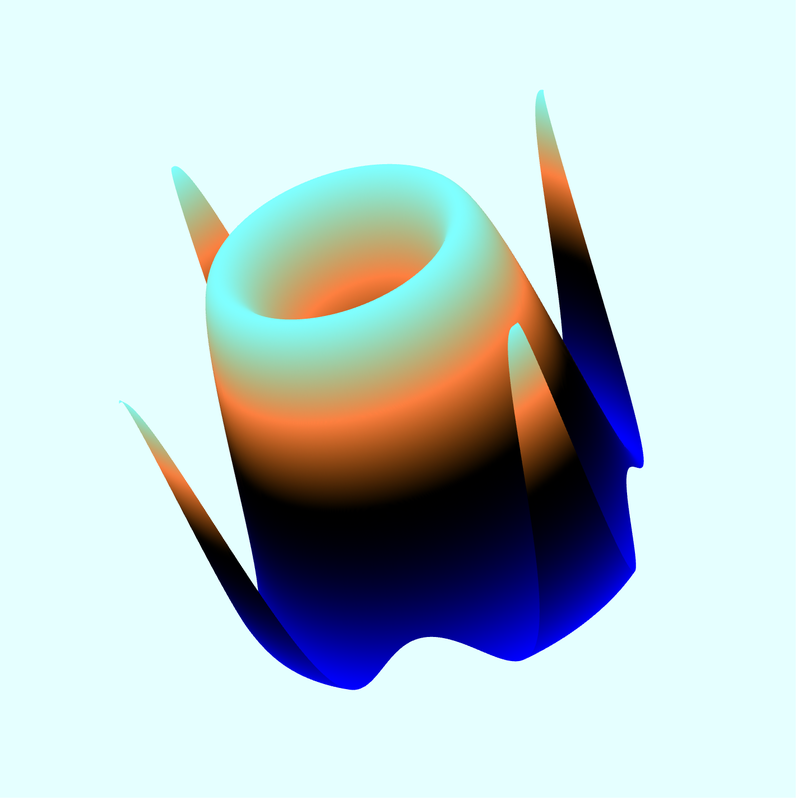
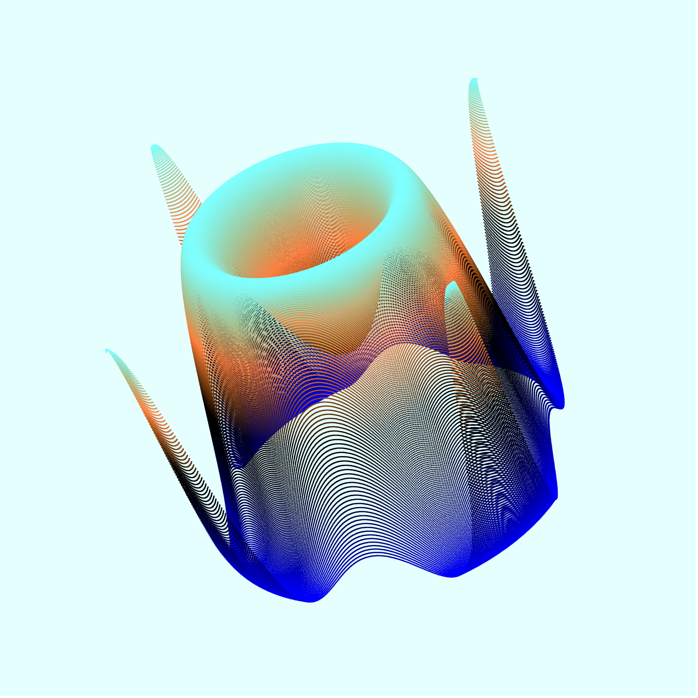

## Function Plotter Documentation ##

### Overview ###

The function plotter plots functions of the form `z = f(x, y)`.
The plotter has two fundamental modes: 2d mode and 3d mode.

##### 2D Mode: #####

In 2d mode, the `z = f(x, y)` function is rendered using a (user definable)
color map which depends on the `z` value of the function, and the `x` and `y`
values are based on the `(x, y)` pixel coordinates of the canvas.

The user is free to explore the function in many ways in 2d mode. The domain
of the function can be changed by panning/zooming with the mouse. Clicking
and dragging will pan the plot view and the mouse wheel will change the scale
of the plot (effecting either a zoom in or out depending on the direction of
the wheel movement). If preferred, panning and zooming can be accomplished via
the arrow keys on the keyboard. (hold the shift key for zooming.) The user can
tweak the RGB color mapping by editing the color function on the page. Most
importantly, the user can edit the function to be plotted.

##### 3D Mode: #####

In 3d mode, the user can no longer change the color mapping or the expressionM
to be evaluated (all such edits should be completed in 2d mode). Instead, the
user is free to explore the plotted function in other ways. In 3d mode, clicking
and dragging the mouse will rotate the plotted function in 3d space. The mouse
wheel zooms into our out of the 3d plot.

### Usage ###

The plotter consists primarily of a canvas area, a color function
editor, a helper function editor, and an expression editor.

**NOTE**: Each of the editable areas will end up modifying the fragment shader.
as such, all of the `GLSL` language is available to implement these functions.
On the other hand, the user is also limited by the `GLSL` language
peculiarities. For example, `GLSL` provides no implicit casting of numeric
literals. e.g. the following expression will cause a compilation error:
`1 + 1.0`! Since almost all of the builtin `GLSL` functions take `float` typed
input, it is probably best to avoid `int` variables and integer constants.


##### Color function: #####

A `GLSL` function named `getcolor()` must be defined. The following definition
is provided as a default:

```java
vec4 getcolor(float z)
{
  float r = z + z > 1.0 ? 1.0 / (z + z) : z + z;
  float g = z     > 1.0 ? 1.0 / (z * z) : z;
  float b = z     > 1.0 ? 1.0 /  z      : z * z;
  return vec4(r, g, b, 1.0);
}
```
##### Helper function(s): #####

An editor is provided so that the user can implement any helper functions they
would like for use in the expression evaluator area. This allows for the use
of functions above and beyond the builtin `GLSL` functions. See the example
section for some interesting uses of the helper function editor.

**Note:** Any global variables declared in this box will be in scope for both
both the color function editor and the expression editor.

##### Expression Editor: #####

An editor box is provided so the user can input an expression to be plotted.
the expression _must_ be in terms of the (internally declared) variables `x`
and `y`. A default expression is provided:
```java
sin( x*x + y*y )
```
However, the user is encouraged to change this expression and plot more
interesting functions.

### How it works: ###

##### 2D: #####

In 2D mode, the plotter is pretty straightforward. When the user hits the
`Render2D` button, the fragment shader is recompiled (or compiled for the first
time if this is the first time the button has been pressed) with `getcolor()`,
any helper functions the user has entered in the helper function editor,
the expression entered into the expression editor, and a bunch of code that
the user is not exposed to. Essentially what is happening is that the
`gl_FragCoord.x` and `gl_FragCoord.y` coordinates are translated into a
user-specified range (e.g. mouse manipulation of the plot) and the translated
`x` and `y` values are evaluated in the user supplied expression. The resultant
`z` value is passed to the `getcolor()` function which returns a `vec4`. The
`vec4` is interpreted as a color which the fragment shader uses to set
`gl_FragColor`.

Since all of the important computation is done on the fragment shader the
rendering is real-time for most reasonable functions.

##### 3D: #####

Once the mode has completely transitioned to 3D, the plotter is trivially
straightforward. The freedom to change the domain of the function and its
color mapping is disabled. In 3D mode the function is plotted as a 3-dimensional
surface. Instead of changing the domain (by panning andzooming) dragging the
mouse rotates the function plot about the appropriate axis. If the shift key is
depressed, dragging up and down will move the plot up and down in the view.
Dragging left or right with the shift key depressed will rotate the function
plot about the z-azis (from the point of view of the camera). The mouse wheel
will move the camera closer or farther away from the plot.

The transition from 2D mode to 3D mode takes several steps to complete.
First, the canvas is resized to 512x512 and re-rendered in 2D mode. An image
of the canvas is saved for later use as a texture map for shading.

Next, the shader is recompiled with an alternate version of `getcolor()` which
encodes the floating point value `z` into a `vec4` of 4 bytes. (*Note: I did not
write the code that does this. It came from this
[StackOverflow answer](http://stackoverflow.com/questions/17981163/webgl-read-pixels-from-floating-point-render-target)*.)
The canvas is re-rendered with this special version of `getcolor()` and the
javascript application makes a call to `gl.readPixels()` and makes a new
`Float32Array` with the buffer data to extract the float values.

Using a simple transformation to convert the `x` and `y` function coordinates
into clip coordinates, the application generates two 512x512 array of vertices.
In both of the arrays the `x, y` part of the vertex is drawn from the
transformed `x` and `y` function coordinates. In one of the arrays, the `z`
value is the unchanged function output and in the other array, the `z` value is
takes the function output and transforms it into the range `[-1, 1]`.

In both cases, `NaN` and `Infinity` are handled (since these are not
appropriate vertex position values) by copying the nearest finite value in the
array.

Even though there are 262,144 vertices in the scene, the points are sent to the
graphics card only once and as a result, the manipulation of the plotted
function is real-time for any computer with a modern graphics card.

### Examples: ###

The default function `sin( x*x + y*y )` with the default color mapping and
bounding box looks like this in 2D mode:



Rendered in 3D (with a small zoom out and rotation):



In 3D mode with 'Points mode' on:



#### Helper Functions ####

The utility of the function plotter is greatly expanded by the ability to
define custom function which can be called by the expression evaluator.

Functions which do not have a closed form or are otherwise best suited to
iterative (or approximate) evaluation can be plotted by defining a helper
function and calling it in the expression editor.

An excellent example of a function which does not have a closed form is the
[Mandelbrot Set](http://en.wikipedia.org/wiki/Mandelbrot_set)

The Mandelbrot set is defined as the set of points `Z` which satisfy the
condition that the expression  is bounded, for all points in the complex plane.

</img>

```java
vec4 getcolor(float z)
{
  if (z == max - 1.0) return vec4( 0,0,0,1 );
  z /= max;
  float r = z + z > 1.0 ? 1.0 / (z + z) : z + z;
  float g = z     > 1.0 ? 1.0 / (z * z) : z;
  float b = z     > 1.0 ? 1.0 / z       : z * z;
  if ( hslMode == 1 ) return hsvToRgb( z, 0.6, 0.5 );
  else return vec4(r, g, b, 1.0);
}
```

```java
const float max = 100.0;
float mandelbrot(float fx, float fy) {
  float iteration  = 0.0;
  float x          = 0.0;
  float y          = 0.0;
  float xtemp      = 0.0;

  for ( float i = 0.0; i < max; ++i  )
  {
    if ( sqrt(x * x + y * y) <= 4.0 ) {
      xtemp = x * x - y * y + fx;
      y = 2.0 * x * y + fy;
      x = xtemp;
      iteration = i;
    }
    else{ break; }
  }
  return iteration;
}
```

```java
const float max = 100.0;
float julia( float x, float y ) {
  float newRe = x;
  float newIm = y;
  float oldRe, oldIm, cRe, cIm;
  cRe = -0.7;
  cIm = 0.27015;
  float z = 0.0;
  for(float i = 0.0; i < max; i++)
  {
    oldRe = newRe;
    oldIm = newIm;
    newRe = oldRe * oldRe - oldIm * oldIm + cRe;
    newIm = 2.0 * oldRe * oldIm + cIm;
    if((newRe * newRe + newIm * newIm) > 4.0) break;
    z = i;
  }
  return z;
}
```
